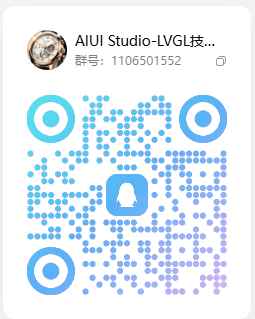
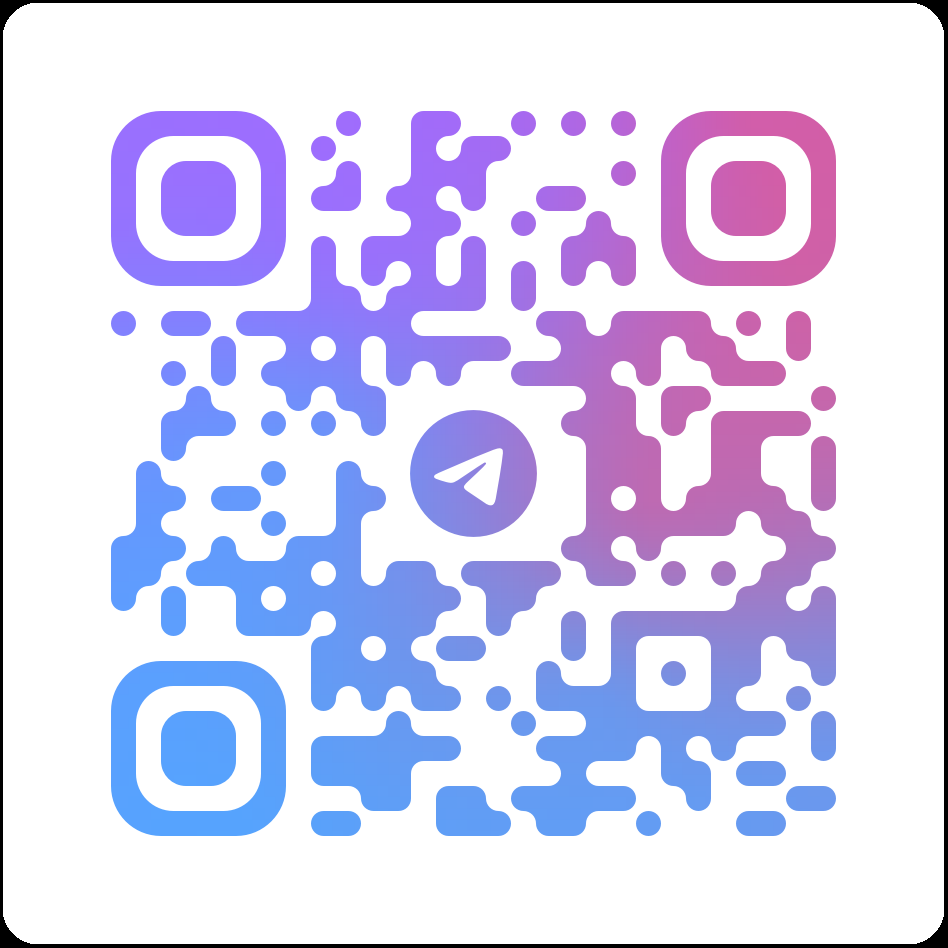
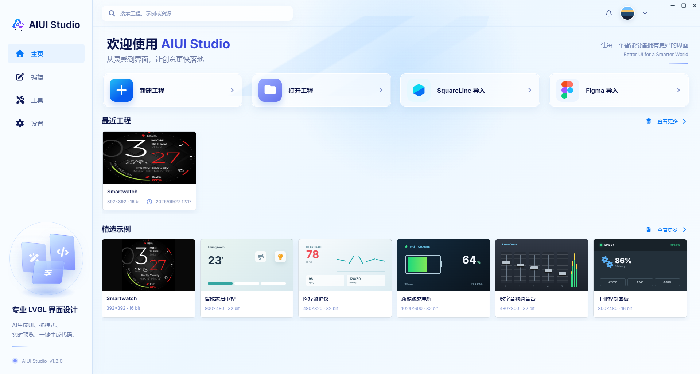
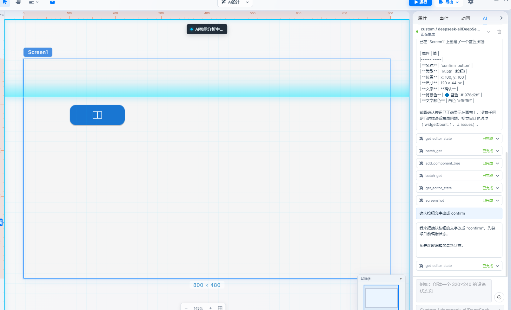
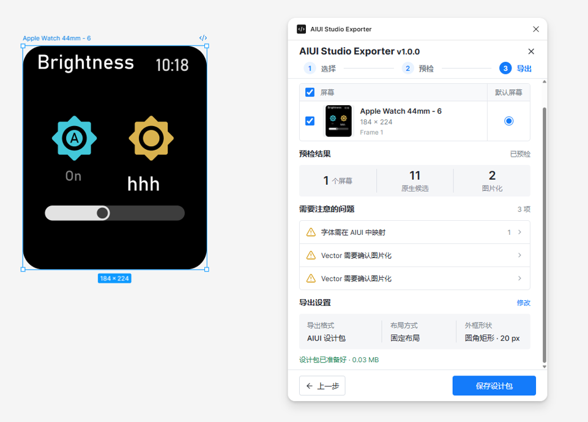
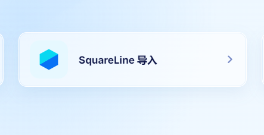
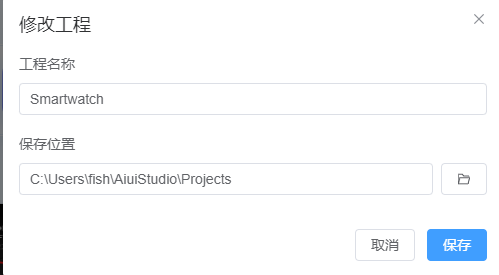
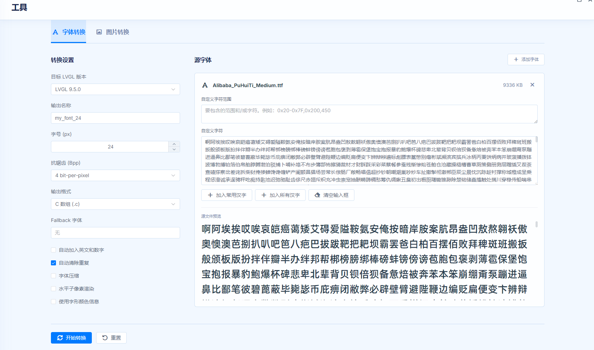

# AIUI Studio

**Language**: 中文 | [English](README_EN.md)

> 一款专业的 LVGL 图形界面可视化设计工具，让嵌入式 UI 开发变得简单而高效。

**加入群聊，第一时间获取AIUI Studio功能特性，与大牛一起探讨技术。**

| QQ: | Telegram： |
| ------------------------------------------------ | ------------------------------------------------------------ |

## 📖 1.简介

LVGL（Light and Versatile Graphics Library）是嵌入式领域最流行的开源 GUI 框架之一，被广泛应用于智能手表、家电面板、车载中控、工业控制屏等设备。然而，传统的 LVGL 开发流程需要在 C 代码中手动编写界面布局、样式和事件逻辑，开发效率低、调试困难、可视化程度差。

AIUI Studio 是一款面向嵌入式设备的 LVGL 界面设计工具，让您像画图一样「拖一拖、点一点」即可完成 UI 设计，提供所见即所得的 UI 设计体验，无需手写一行 C 代码。设计完成即可一键导出标准 LVGL C 源码，直接集成到您的嵌入式项目中，大幅降低 LVGL 开发门槛。并且提供内置 AI 助手 + 外部 AI Agent （Codex、Claude Code、TRAE 、Cursor等）自然语言描述需求，自动生成LVGL代码，大幅提高嵌入UI开发效率，彻底解放生成力。

无论您是资深 LVGL 工程师，还是初次接触嵌入式界面的设计师，AIUI Studio 都能帮您把想法快速变成真实可用的屏幕界面。

## 🎯 2.为什么选择 AIUI Studio
- **AI 设计** —— 加入AI设计LVGL界面，用自然语言开发嵌入式界面，效率直接翻倍，关键开放接入能力，支持Codex、Claude Code、TRAE 、Cursor等外部AI工具接入，也提供内置AI助手，满足各种AI编程需求
- **Figma设计稿导入** —— 首创支持Figma 设计稿一键导出到AIUI Studio工程，效率翻倍
- **SquareLine工程导入** —— 首创支持对SquareLine工程导入支持，方便移植之前项目工程
- **所见即所得** —— 设计效果实时呈现，屏幕就在眼前，无需依赖想象
- **一次设计，多版本可用** —— 一套界面对接多个 LVGL 版本，改代码适配的烦恼交给工具
- **数据安全** ——  完全离线可用，无需联网（可对接内网ai大模型），设计数据不出本地，保证企业数据安全
- **支持多国语言**—— 软件支持中文、英文显示，无需翻译，未来还会增加更多语言
- **离线字体图片转换器**—— 离线也可转换字体、图片，随时生成LVGL C语言数组、bin格式
- **跨平台支持** —— 支持Windows、MACOS 、Linux，Windows最低支持Win7 64位，如今很多lvgl编辑均不支持win7旧系统，但我们还支持

## ✨ 3.核心功能

### 🤖 3.1 AI 设计

- 用一句「人话」描述想要的界面，AI 帮你快速生成
- 支持与 Cursor、TRAE、Claude Code、Codex 等 AI 工具协作
- 让 AI 帮你排版、调样式，效率翻倍

### 🚀3.2  一键导入Figma设计稿，打通UI设计大门

- 通过AIUI Studio Exporter插件，一键导出Figma设计稿，通过AIUI Studio进行导入

- 导入 **Figma** 设计稿，字体等资源自动关

  

### 🚀 3.3 一键导入quareLine 工程，平滑迁移旧工程

- 直接导入 **SquareLine Studio** 的项目，平滑迁移

  

### 🎨 3.4 拖拽式可视化设计

- 把控件从「组件库」拖到画布，摆放、缩放、对齐，简单直观
- 实时预览设计效果，所见即所得
- 网格与参考线辅助，轻松实现像素级对齐

### 🧩 3.5 丰富的控件库

内置 **40+ 种 LVGL 控件**，一键拖入即可使用：

- **常用控件** —— 按钮、输入框、滑块、开关、列表等
- **高级组件** —— 图表、仪表盘、进度条、日历、圆弧等
- **自定义控件** —— 把多个控件组合封装，像积木一样复用

### ⚙️ 3.6 所见即所得的样式调节

- 选个控件，在面板上调一调即可改变外观，无需记忆复杂的样式属性名
- 支持按压、禁用等多种状态分别设置样式
- 把喜欢的样式存成模板，一键套用到其他控件

### ⚡ 3.7 多版本 LVGL 全面兼容

- 支持 LVGL **8.4.0 / 9.2.2 / 9.3.0 / 9.4.0 / 9.5.0** 全系版本，9.6.0正在适配敬请期待...
- 版本之间的差异自动处理，切换版本不用重新设计界面
- 一套设计，适配您项目的任意 LVGL 版本

### 🔀 3.8 一键导出 C 代码

- 点击「导出」，即可得到标准 LVGL C 源码，附带资源文件与工程脚本
- 代码可直接编译，无缝集成到您的嵌入式工程
- 支持导出 PC 模拟器模板工程，先在电脑上跑通再上真机

### ▶️ 3.9 真机级实时预览（Run 模式）

- 无需烧录设备，在电脑上即可预览真实运行效果
- 支持触摸与手势交互，滑动切屏如同真机体验
- 交互动画完整还原，所见即所得

### 🎞️ 3.10交互动画轻松做

- 不需要写动画代码，可视化编排多元素联动效果
- 多种过渡效果可选，动画实时预览
- 让界面告别生硬，动起来更灵动

### 🎯 3.11 交互逻辑不写代码

- 内置丰富的常用动作用来配置交互，无需编程
- 轻松建立控件之间的联动关系
- 复杂逻辑也能通过可视化方式完成

### 🌐 3.12 多语言界面支持

- 同一套界面自动适配中文、英文等多语言
- 自定义字符集与字体，满足各国语言显示需求
- 内置字体、图片转换工具，一键生成所需资源

### 🎯 3.13 交互逻辑不写代码

- 内置丰富的常用动作用来配置交互，无需编程

- 轻松建立控件之间的联动关系

- 复杂逻辑也能通过可视化方式完成

### 🔂 3.14 工程复用
- 支持修改工程名称、工程存放位置

- 支持复制工程，直接复刻一份工程

  

### 🔒 3.15 开箱即用，完全离线

- 安装即可使用，无需繁琐配置，上手零门槛

- 完全离线可用，无需联网，设计数据不出本地

- 满足公司对产品信息安全的要求，安心用于企业内部开发

### 🛠️ 3.16 独立字体与图片转换工具

- 内置独立的字体转换工具，免去 LVGL 在线转换，本地即可生成字体文件

- 内置独立的图片转换工具，本地即可完成图片资源转换

- 转换全程不依赖网络，资源数据更安全

- 

## 🚀 4.快速上手

只需五分钟，做出你的第一块 LVGL 界面：

1. **下载安装** —— 前往官方网站或 GitHub Releases 下载对应平台的安装包并安装
2. **新建项目** —— 设置分辨率、选择 LVGL 版本，项目即刻创建
3. **拖拽控件** —— 从左侧组件库把按钮、标签等控件拖到画布上
4. **调整样式** —— 在右侧面板调整位置、尺寸、颜色、字体等属性
5. **实时预览** —— 点击「运行（Run）」，在电脑上预览真实效果
6. **导出代码** —— 一键导出 C 代码，集成到您的嵌入式项目

## 🎯 5.适用人群

- **LVGL 嵌入式开发者** —— 快速搭建界面，一键生成可用代码
- **UI / UX 设计师** —— 无需了解 C 代码细节，可视化完成嵌入式 UI 设计
- **产品经理** —— 快速验证界面方案，所见即所得，降低沟通成本
- **SquareLine Studio 用户** —— 项目一键导入，无缝切换工具

## 🎯 6.系统要求

| 平台 | 最低要求 |
|------|---------|
| **Windows** | Windows 7 及以上 64位 |
| **macOS** | macOS 11 (Big Sur) 及以上 |
| **Linux** | Ubuntu 20.04+ / Debian 11+ 等主流发行版 |

通用要求：4GB 以上内存，支持 WebGL 的显卡驱动。

## 📥 7.下载安装

- 官方网站：[https://aiuistudio.aiaode.com](https://aiuistudio.aiaode.com)
- GitHub Releases：[https://github.com/fishercc/aiuistudioapp/releases](https://github.com/fishercc/aiuistudioapp/releases)
- 网盘下载

  - 下载地址1：https://www.guangyapan.com/s/1951307935048769588_arkZclS8wyMtssh-
  - 下载地址2：https://pan.quark.cn/s/f49be5b058cb
  - 下载地址3：https://pan.baidu.com/s/1ZGUfZhwFshpApFR6rHCw4A?pwd=b7ma 

选择对应平台的安装包，按常规方式安装即可：

- Windows：`.exe` 安装程序
- macOS：`.dmg` 镜像文件
- Linux：`.AppImage` 或 `.deb` 包

## 📚 8.文档

如需了解详细功能与操作说明，请访问官方网站的[文档](https://aiuistudio.aiaode.com/docs)

## 🤝 9.社区与支持

- 📧 **问题反馈** —— 遇到问题或有功能建议，欢迎提交 [Issue](https://github.com/fishercc/aiuistudioapp/issues)

- 🌐 **官方网站** —— [https://aiuistudio.aiaode.com](https://aiuistudio.aiaode.com)

- 💬 **社区讨论** —— 加入我们的社区群组，共同创建好用工具，分享技术共同进步。

  

  |                  |                                                              |
  | ---------------- | ------------------------------------------------------------ |
  | [QQ群：1106501552](https://qm.qq.com/q/LJDHUjT4qG) |  |
  | [Telegram](https://t.me/+mH7H9ZkKm30xNmY0)        |   |

  

  

## 📄 10.许可证

本项目采用 [MIT License](LICENSE) 许可证，引用需要保留版权声明。

## 🙏 致谢

感谢 [LVGL](https://lvgl.io/) 项目提供的强大图形库支持。

---

**AIUI Studio** —— 让嵌入式 UI 开发更简单、更高效！