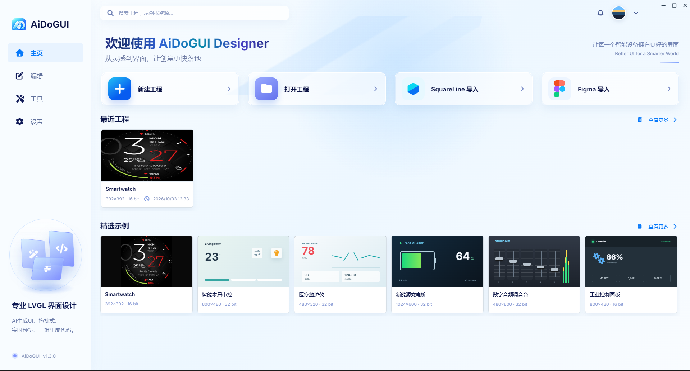

# AIUI Studio

**Language**: [中文](README.md) | English

> A professional LVGL graphical interface visual design tool that makes embedded UI development simple and efficient.

**Join our community groups and get the latest AIUI Studio features while discussing technology with other experts.**

| QQ:  | Telegram:  |
| ----------------------------------------------------- | ----------------------------------------------------------- |

## 📖 1. Introduction

LVGL (Light and Versatile Graphics Library) is one of the most popular open-source GUI frameworks in the embedded field, widely used in smartwatches, home appliance panels, automotive infotainment, industrial control screens, and other devices. However, the traditional LVGL development workflow requires manually writing interface layouts, styles, and event logic in C code, resulting in low development efficiency, difficult debugging, and poor visualization.

AIUI Studio is an LVGL interface design tool for embedded devices. You can complete your UI design just by "drag and drop" — no C code required. Enjoy a what-you-see-is-what-you-get design experience without writing a single line of C code. Once the design is done, export standard LVGL C source code with one click and integrate it directly into your embedded project, dramatically lowering the barrier to LVGL development. It also provides a built-in AI assistant plus external AI agents (Codex, Claude Code, TRAE, Cursor, etc.) that generate LVGL code from natural-language descriptions, greatly improving embedded UI development efficiency.

Whether you are an experienced LVGL engineer or a designer new to embedded interfaces, AIUI Studio turns your ideas into real, working screens quickly.

## 🎯 2. Why Choose AIUI Studio

- **AI Design** — Design LVGL interfaces with AI and develop embedded interfaces using natural language, doubling efficiency. With open integration capabilities, it supports external AI tools such as Codex, Claude Code, TRAE, and Cursor, as well as a built-in AI assistant to meet all kinds of AI coding needs
- **Figma Design Import** — First to support one-click export from Figma designs to an AIUI Studio project, doubling your efficiency
- **SquareLine Project Import** — First to support importing SquareLine projects, making it easy to migrate existing projects
- **What You See Is What You Get** — Design results are shown in real time; the screen is right in front of you
- **Design Once, Run on Multiple Versions** — One interface works with multiple LVGL versions; let the tool handle the adaptation
- **Data Security** — Works completely offline with no internet connection required (supports intranet AI large models); your design data never leaves your machine, ensuring enterprise data security
- **Multi-Language Support** — The software supports Chinese and English display out of the box, with more languages to be added in the future
- **Offline Font & Image Converter** — Convert fonts and images even when offline, generating LVGL C arrays and binary (bin) formats anytime
- **Cross-Platform Support** — Supports Windows, macOS, and Linux; minimum Windows support is Win7 64-bit. Many LVGL editors today no longer support the old Win7 system, but we still do

## ✨ 3. Core Features

### 🤖 3.1 AI Design

- Describe the interface you want in plain language and let AI generate it quickly
- Supports collaboration with AI tools such as Cursor, TRAE, Claude Code, and Codex
- Let AI handle layout and styling to double your efficiency

### 🚀 3.2 One-Click Figma Import, Opening the Door to UI Design

- Use the AIUI Studio Exporter plugin to export Figma designs in one click and import them through AIUI Studio

- Import **Figma** designs with automatic association of fonts and other resources

  

### 🚀 3.3 One-Click SquareLine Project Import for Smooth Migration

- Import **SquareLine Studio** projects directly for a smooth migration

  

### 🎨 3.4 Drag-and-Drop Visual Design

- Drag widgets from the component library onto the canvas, then place, resize, and align them with ease
- Real-time preview of your design — what you see is what you get
- Grid and guide lines for pixel-perfect alignment

### 🧩 3.5 Rich Widget Library

Built-in **40+ LVGL widgets**, ready to drop in:

- **Common Controls** — Buttons, input fields, sliders, switches, lists, and more
- **Advanced Components** — Charts, gauges, progress bars, calendars, arcs, and more
- **Custom Widgets** — Combine multiple widgets into reusable building blocks

### ⚙️ 3.6 WYSIWYG Style Tuning

- Select a widget and tweak it in the panel to change its look — no need to memorize complex style property names
- Set different styles for pressed, disabled, and other states
- Save your favorite styles as templates and apply them to other widgets in one click

### ⚡ 3.7 Full Multi-Version LVGL Support

- Supports LVGL **8.4.0 / 9.2.2 / 9.3.0 / 9.4.0 / 9.5.0**; 9.6.0 is being adapted, stay tuned...
- Differences between versions are handled automatically — no need to redesign when switching versions
- One design, works with any LVGL version your project uses

### 🔀 3.8 One-Click C Code Export

- Click "Export" to get standard LVGL C source code, bundled with resource files and build scripts
- The code compiles directly and integrates seamlessly into your embedded project
- Export PC simulator template projects to verify on your computer before flashing to hardware

### ▶️ 3.9 Real-Device Preview (Run Mode)

- Preview real running behavior on your computer without flashing to a device
- Touch and gesture interaction support, including swipe-to-switch-screens, just like a real device
- Interaction animations reproduced faithfully — what you see is what you get

### 🎞️ 3.10 Effortless Interaction Animations

- Build coordinated multi-element animations visually, no animation code required
- Multiple transitions to choose from, with real-time animation preview
- Bring your interface to life and make it feel more responsive

### 🎯 3.11 Interaction Logic Without Code

- Configure interactions using common built-in actions, no programming required
- Easily link widgets together for coordinated behavior
- Even complex logic can be done visually

### 🌐 3.12 Multi-Language Interface Support

- One interface automatically adapts to Chinese, English, and more languages
- Custom character sets and fonts for global display needs
- Built-in font and image conversion tools to generate the resources you need in one click

### 🎯 3.13 Interaction Logic Without Code

- Configure interactions using common built-in actions, no programming required

- Easily link widgets together for coordinated behavior

- Even complex logic can be done visually

### 🔂 3.14 Project Reuse

- Supports modifying the project name and project storage location

- Supports duplicating a project to directly clone a copy

  

### 🔒 3.15 Out of the Box, Fully Offline

- Install and start using immediately — no complex configuration, zero learning curve

- Works completely offline with no internet connection required; your design data never leaves your machine

- Meets corporate information security requirements, safe for internal enterprise development

### 🛠️ 3.16 Standalone Font and Image Conversion Tools

- Built-in standalone font conversion tool — no need for the LVGL online converter, generate font files locally

- Built-in standalone image conversion tool — convert image resources locally

- The entire conversion process works without network access, keeping your resource data more secure

- 

## 🚀 4. Quick Start

Create your first LVGL interface in just five minutes:

1. **Download & Install** — Download the installer for your platform from the official website or GitHub Releases and install it
2. **Create a Project** — Set the resolution and choose an LVGL version; the project is ready instantly
3. **Drag Widgets** — Drag buttons, labels, and other widgets from the library onto the canvas
4. **Tune the Style** — Adjust position, size, color, font, and other properties in the panel
5. **Preview in Real Time** — Click "Run" to preview the real effect on your computer
6. **Export Code** — Export C code with one click and integrate it into your embedded project

## 🎯 5. Who Is It For

- **LVGL Embedded Developers** — Build interfaces quickly and generate ready-to-use code
- **UI / UX Designers** — Create embedded UI visually without learning C code details
- **Product Managers** — Validate interface designs quickly with WYSIWYG previews and lower communication costs
- **SquareLine Studio Users** — Import projects in one click and switch tools seamlessly

## 🎯 6. System Requirements

| Platform | Minimum Requirement |
|----------|---------------------|
| **Windows** | Windows 7 or later (64-bit) |
| **macOS** | macOS 11 (Big Sur) or later |
| **Linux** | Ubuntu 20.04+ / Debian 11+ and other mainstream distributions |

General requirements: 4GB+ RAM and a WebGL-capable graphics driver.

## 📥 7. Download & Install

- Official Website: [https://aiuistudio.aiaode.com](https://aiuistudio.aiaode.com)
- GitHub Releases: [https://github.com/fishercc/aiuistudioapp/releases](https://github.com/fishercc/aiuistudioapp/releases)
- Cloud Drive Downloads

  - Mirror 1: https://www.guangyapan.com/s/1951307935048769588_arkZclS8wyMtssh-
  - Mirror 2: https://pan.quark.cn/s/f49be5b058cb
  - Mirror 3: https://pan.baidu.com/s/1ZGUfZhwFshpApFR6rHCw4A?pwd=b7ma

Choose the installer for your platform and install it as usual:

- Windows: `.exe` installer
- macOS: `.dmg` image
- Linux: `.AppImage` or `.deb` package

## 📚 8. Documentation

For detailed feature descriptions and operation guides, please visit the official website [documentation](https://aiuistudio.aiaode.com/docs).

## 🤝 9. Community and Support

- 📧 **Issue Feedback** — If you encounter problems or have feature suggestions, please submit an [Issue](https://github.com/fishercc/aiuistudioapp/issues)

- 🌐 **Official Website** — [https://aiuistudio.aiaode.com](https://aiuistudio.aiaode.com)

- 💬 **Community Discussion** — Join our community groups to build great tools together, share technology, and grow together.

  |                  |                                                              |
  | ---------------- | ------------------------------------------------------------ |
  | [QQ Group: 1106501552](https://qm.qq.com/q/LJDHUjT4qG) |  |
  | [Telegram](https://t.me/+mH7H9ZkKm30xNmY0)        |   |

## 📄 10. License

This project is licensed under the [MIT License](LICENSE). Attribution must retain the copyright notice.

## 🙏 Acknowledgments

Thanks to the [LVGL](https://lvgl.io/) project for providing powerful graphics library support.

---

**AIUI Studio** — Making embedded UI development simpler and more efficient!